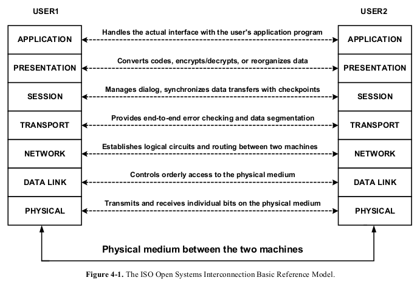
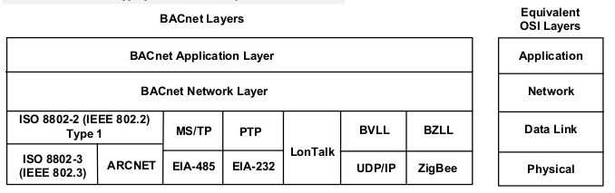

BACnet PROTOCOL ARCHITECTURE
============================

The Open System Interconnection (OSI) - Basic Reference Model (ISO 7498) is an international standard that defines a
model for developing multi-vendor computer communication protocol standards. The OSI model addresses the general
problem of computer-to-computer communication and breaks this very complex problem into seven smaller, more
manageable sub-problems, each of which concerns itself with a specific communication function. Each of these sub-problems
forms a "layer" in the protocol architecture.

The seven layers are arranged in a hierarchical fashion as shown in Figure 4-1. A given layer provides services to the layers
above and relies on services provided to it by the layers below. Each layer can be thought of as a black box with carefully
defined interfaces on the top and bottom. An application process connects to the OSI application layer and communicates
with a second, remote application process. This communication appears to take place between the two processes as if they
were connected directly through their application layer interfaces. Minimal knowledge or understanding of the other layers is
required. In a similar manner, each layer of the protocol relies on lower layers to provide communication services and
establishes a virtual peer-to-peer communication with its companion layer on the other system. The only real connection
takes place at the physical layer.

The OSI model addresses computer-to-computer communication from a very general perspective. It was designed to deal
with the problems associated with computers in large, complex networks communicating with other computers in networks
anywhere in the world. In this environment, computers can be separated by long distances and the messages might pass
through several intermediate points, each of which may have to make routing decisions or perform some type of translation.
Complex synchronization and error recovery schemes may also be needed.

The cost of implementing such a protocol today is prohibitively high for most building automation applications and is not
generally required. Nevertheless, the OSI model is a good one to use for a building automation protocol if consideration is
given to including only the OSI functionality that is actually needed, thereby collapsing the seven-layer architecture. In a
collapsed architecture, only selected layers of the OSI model are included. The other layers are effectively null, thus reducing
message length and communication processing overhead. Such a collapsed architecture permits the building automation
industry to take advantage of lower cost, mass-produced processor and local area network technologies such as have been
developed for the process control and office automation industries. The use of readily available, widespread technologies,
such as Ethernet, ARCNET, and LonTalk, will lower the cost, increase performance, and open new doors to system
integration.

The BACnet Collapsed Architecture
---------------------------------

BACnet is based on a four-layer collapsed architecture that corresponds to the physical, data link, network, and application
layers of the OSI model as shown in Figure 4-2. The application layer and a simple network layer are defined in the BACnet
standard. BACnet provides seven options that correspond to the OSI data link and physical layers. Option 1 is the logical link
control (LLC) protocol defined by ISO 8802-2 Type 1, combined with the ISO 8802-3 medium access control (MAC) and
physical layer protocol. ISO 8802-2 Type 1 provides unacknowledged connectionless service only. ISO 8802-3 is the
international standard version of the well-known "Ethernet" protocol. Option 2 is the ISO 8802-2 Type 1 protocol combined
with ARCNET (ATA 878.1). Option 3 is a Master-Slave/Token-Passing (MS/TP) protocol designed specifically for building
automation and control devices as part of the BACnet standard. The MS/TP protocol provides an interface to the network
layer that looks like the ISO 8802-2 Type 1 protocol and controls access to an EIA-485 physical layer. Option 4, the Point-
To-Point protocol, provides mechanisms for hardwired or dial-up serial, asynchronous communication. Option 5 is the
LonTalk protocol. Option 6, BACnet/IP, permits BACnet devices to use standard Internet Protocols (UDP and IP) as a virtual
data link layer. Option 7, ZigBee, provides a wireless datalink. Collectively these options provide a master/slave MAC,
deterministic token-passing MAC, high-speed contention MAC, dial-up access, star and bus topologies, and a choice of
twisted-pair, coax, or fiber optic media, in addition to wireless connectivity. The details of these options are described in
Clauses 7 through 11 Annex J, and Annex O.

A four-layer collapsed architecture was chosen after careful consideration of the particular features and requirements of BAC
networks, including a constraint that protocol overhead needed to be as small as possible. The reasoning behind the selection
of the physical, data link, network, and application layers for inclusion in the BACnet architecture is outlined in this
subclause.

What layers are required for the proper operation of a BAC network? BAC networks function as local area networks, either
physically, as with MS/TP, or logically, as with BACnet/IP. This is true even though in some applications it is necessary to
exchange information with devices in a building that is very far away. This long-distance communication is done through the
telephone networks or across the Internet. The routing, relaying, and guaranteed delivery issues are handled by the telephone
and Internet systems and can be considered external to the BAC network. BAC devices are static. They don't move from
place to place and the functions that they are asked to perform do not change in the sense that a manufacturing device may
make one kind of part today and some very different part tomorrow. These are among the features of BAC networks that can
be used to evaluate the appropriateness of the layers in the OSI model.

The **physical layer** provides a means of connecting the devices and transmitting the electronic signals that convey the data.
Clearly the physical layer **is needed** in a BAC protocol.

The **data link layer** organizes the data into frames or packets, regulates access to the medium, provides addressing, and
handles some error recovery and flow control. These are all functions that are required in a BAC protocol. The conclusion is
that the data link layer **is needed**.

Functions provided by the **network layer** include translation of global addresses to local addresses, routing messages through
one or more networks, accommodating differences in network types and in the maximum message size permitted by those
networks, sequencing, flow control, error control, and multiplexing. BACnet is designed so that there is **only one logical path
between devices**, thus eliminating the need for optimal path routing algorithms. A network is made up of one or more
physical segments connected by repeaters or bridges but **with a single local address space**. In the case of a single network,
most network layer functions are either unnecessary or duplicate data link layer functions. For some BACnet systems,
however, the network layer is a necessity. This is the case when two or more networks in a BACnet internet use different
MAC layer options. When this occurs, there is a need to recognize the difference between local and global addresses and to
route messages to the appropriate networks. BACnet provides this **limited network layer** capability by defining a network
layer header that contains the necessary addressing and control information.

The **transport layer** is responsible for guaranteeing end-to-end delivery of messages, segmentation, sequence control, flow
control, and error recovery. Most of the functions of the transport layer are similar to functions in the data link layer, though
different in scope. The scope of transport layer services is end-to-end whereas the scope of data link services is point-to-point
across a single network. Since BACnet supports configurations with multiple networks, the protocol must provide the end-to-
end services of the transport layer. Guaranteed end-to-end delivery and error recovery are provided in the BACnet application
layer via message retry and timeout capabilities. **Message segmentation** and **end-to-end flow control** is required for buffer and
processor resource management. This is because potentially large amounts of information may be returned for even simple
BACnet requests. These functions are **provided in the BACnet application layer**. Last, sequence control is required in order to
properly reassemble segmented messages. This is provided in the BACnet application layer within the segmentation
procedure. Since BACnet is based on a connectionless communication model, the scope of the required services is limited
enough to justify implementing these at a higher layer, thus saving the communication overhead of a separate transport layer.

The **session layer** is used to establish and manage long dialogues between communicating partners. Session layer functions
include establishing synchronization checkpoints and resetting to previous checkpoints in the event of error conditions to
avoid restarting an exchange from the beginning. Most communications in a BAC network are very brief. For example,
reading or writing one or a few values, notifying a device about an alarm or event, or changing a setpoint. Occasionally
longer exchanges take place, such as uploading or downloading a device. The few times when the services of this layer would
be helpful do not justify the additional overhead that would be imposed on the vast majority of transactions, which are very
brief and **do not need** them.

The **presentation layer** provides a way for communicating partners to negotiate the transfer syntax that will be used to
conduct the communication. This transfer syntax is a translation from the abstract user view of data at the application layer to
sequences of octets treated as data at the lower layers. If **only one transfer syntax is permitted**, then the presentation layer
function reduces to an encoding scheme for representing the application data. BACnet defines such a fixed encoding scheme
and includes it in the application layer, making an explicit **presentation layer unnecessary**.

The **application layer** of the protocol provides the communication services required by the applications to perform their
functions, in this case monitoring and control of HVAC&R and other building systems. Clearly an application layer **is needed**
in the protocol.

In summary:
    (a) The resource and overhead costs for implementing a full OSI seven-layer architecture make it impractical for
        current building automation devices.

    (b) Following the OSI model offers advantages in terms of adopting existing computer networking technology. This
        can result in cost savings and make integration with other computer network systems easier.
        
    (c) The expectations and environment of building automation systems permit simplification of the OSI model by
        eliminating the functionality of some of the layers.
        
    (d) A collapsed architecture made up of the physical, data link, network, and application layers is the optimum
        solution for today's building automation systems.

